# License Plate Number Detection (LPND)

В этой статье мы поговорим о системах обнаружения автомобильных номерных знаков. Будут объяснены несколько существующих методов, их минусы и плюсы, а также ситуации, в которых их применяют.  
В этой статье приведён минимум необходимого для понимания темы. Немного затронем и тему __License Plate Recognition (LPR)__, но не будем в неё углубляться, а рассмотрим лишь первый этап __LPR__, то есть __LPND__. Делаю это потому, что новички в этой области могут путать эти два понятия, а начинать всегда нужно с чего-то одного — и мы начнём с изучения __LPND__.

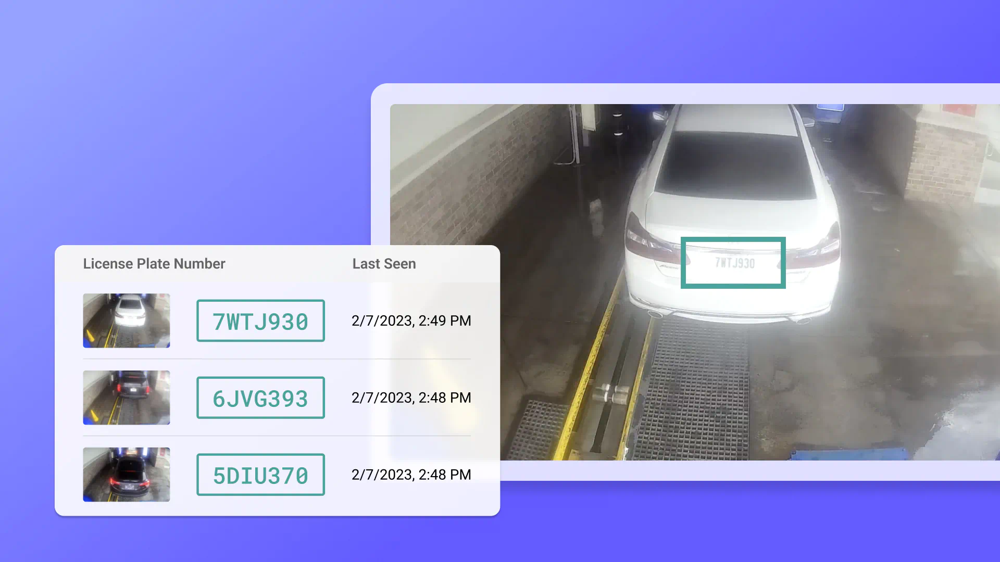

## Table of Contents <a id="content"></a>

1) [Введение](#introduction)  
2) [Основные применения LPR](#key-applications-of-lpr)  
3) [Распознавание номерных знаков (LPR)](#lpr)  
   1. [Структура алгоритма](#lpr-structure)  
4) [Обнаружение номерного знака (LPND)](#lpnd)  
   1. [Анализ контуров объектов](#object-contour-analysis)  
   2. [Сегментный анализ границ](#segmented-boundary-analysis)  
   3. [Анализ гистограмм областей](#histogram-analysis-of-regions)  
   4. [Статистический анализ, классификаторы](#statistical-analysis-classifiers)  
5) [Реализация LPND](#implementation-lpnd)  
   1. [Настройка среды](#setting-up-the-environment)  
   2. [Импорт необходимых библиотек](#importing-required-libraries)  
   3. [Чтение изображения и применение фильтров](#reading-image-and-applying-filters)  
   4) [Детектирование границ](#edge-detection)  
   5) [Поиск контуров](#finding-contours)  
   6) [Отметка номерного знака](#marking-number-plate)  
   7) [Выделение номерного знака](#extract-number-plate)  
7) [Продвинутые техники LPR](#advanced-lpr)  
8) [Заключение](#conclusion)  
9) [References](#references)

---

## Введение <a id="introduction"></a> [&#129093;](#content)

В общем случае __License Plate Number Detection (LPND)__ — это часть __LPR__; __LPND__ состоит в обнаружении номерного знака автомобиля, то есть в нахождении его положения и границ на изображении. Затем идёт вторая часть __LPR__ — распознавание текста в области, выделенной на предыдущем этапе, где уже применяется __Optical Character Recognition (OCR)__.

---

## Основные применения LPR <a id="key-applications-of-lpr"></a> [&#129093;](#content)

1. __Управление движением__ → *LPR помогает отслеживать поток транспорта, выявлять нарушения и управлять загруженностью путём автоматизации сбора платы за проезд или приоритизации полос. Также это ускоряет реагирование экстренных служб, позволяя быстро идентифицировать их автомобили.*  
2. __Правоохранительные органы__ → *Полиция использует системы LPR для отслеживания угнанных автомобилей, выявления подозреваемых и пометки машин с просроченными штрафами. Эти системы дают возможность в реальном времени контролировать передвижение транспорта и хранить историю маршрутов, что помогает собирать доказательства в уголовных делах.*  
3. __Управление парковкой и контроль доступа__ → *Системы LPR преобразили управление парковками, позволяя автомобилям заезжать и выезжать без физических талонов. Это стало широко распространено в школах, офисах, жилых комплексах и на объектах критической инфраструктуры, где контроль доступа транспортных средств крайне важен. По номерному знаку система автоматически предоставляет или запрещает доступ согласно заданным правам.*

---

## Распознавание номерных знаков (LPR) <a id="lpr"></a> [&#129093;](#content)

Для распознавания номера автомобиля существует множество решений и различных алгоритмов, каждый из которых имеет свои плюсы и минусы. Однако в первую очередь важна _аппаратная часть_: каким бы совершенным ни был алгоритм, если камера не способна выдавать высокое качество съёмки и чётко фиксировать номер, либо мощности сервера недостаточно для обработки потока изображений в реальном времени, алгоритм работать не будет.  
Ниже два примера изображений: на первом машина и её номер хорошо различимы, а на втором из-за движения и размытия номер почти неразборчив:

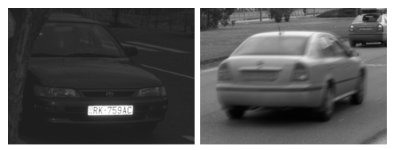  
*__Image:__ два примера: высокое качество и размытие.*

### Структура алгоритма <a id="lpr-structure"></a> [&#129093;](#lpr)

Как уже говорилось, сначала детектируется зона номерного знака, затем происходит распознавание текста. Между этими шагами располагается этап __нормализации контраста__, техника предобработки изображения для повышения чёткости и видимости деталей.

1. __License Plate Number Detection__ → _Обнаружение области, где находится номер автомобиля._  
2. __License Plate Number Normalization__ → _Выделение границ номерной таблички и нормализация контраста._  
3. __Optical Character Recognition__ → _Извлечение текста из нормализованного изображения._

---

## Обнаружение номерного знака (LPND) <a id="lpnd"></a> [&#129093;](#content)

Как упоминалось ранее, сегодня существует множество методов для детекции номерных табличек. Рассмотрим некоторые из них, а затем проведём небольшую практику на Python, чтобы каждый мог самостоятельно попробовать.

### Анализ контуров объектов <a id="object-contour-analysis"></a> [&#129093;](#lpnd)

Самый очевидный метод — поиск контуров прямоугольника. Однако этот подход работает только при чётко выраженном контуре (а на практике табличка может быть повреждена или загрязнена), и важно качество съёмки. Ниже пример ограничений такого метода.

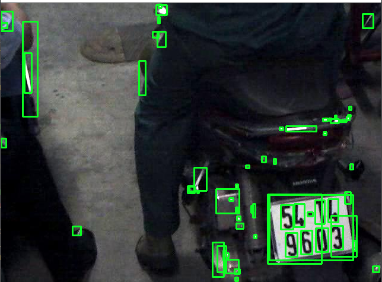  
*__Image:__ пример анализа контуров на неподходящем изображении.*

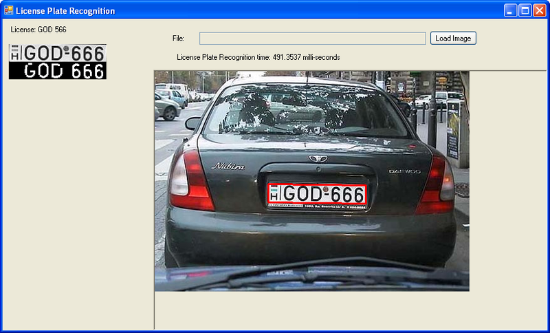  
*__Image:__ пример анализа контуров на подходящем изображении.*

__Как это работает:__  
1. *Фильтрация изображения для поиска контуров.*  
2. *Выбор и анализ контуров.*  

Это не самый эффективный метод, но в некоторых случаях он может оказаться лучшим решением.

### Сегментный анализ границ <a id="segmented-boundary-analysis"></a> [&#129093;](#lpnd)

Этот метод чуть сложнее, но эффективнее: анализируются лишь отдельные сегменты таблички. Сначала находятся все контуры, затем определяются вертикальные сегменты. Предполагается, что любые два вертикальных сегмента, расположенных близко друг к другу с небольшой разницей по оси Y и имеющих корректное расстояние для длины таблички, указывают на место расположения номера.

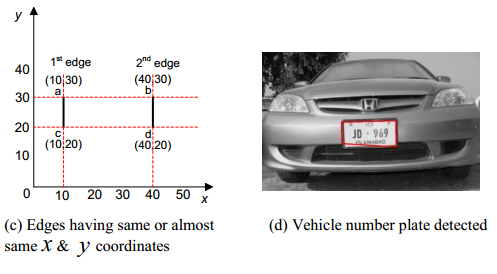  
*__Image:__ геометрическая модель SBA для детекции таблички.*

Минусы: если табличка наклонена, вертикальные сегменты не будут обнаружены. Кроме того, метод чувствителен к шуму — защитные планки, украшения, неравномерное освещение и т. д.

### Анализ гистограмм областей <a id="histogram-analysis-of-regions"></a> [&#129093;](#lpnd)

Данный метод основывается на том, что область с табличкой имеет специфическое распределение интенсивности пикселей (гистограмма), отличное от остальных частей изображения.

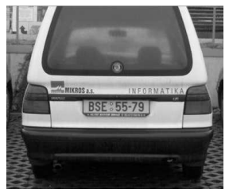  
*__Image:__ автомобиль почти на всём кадре.*

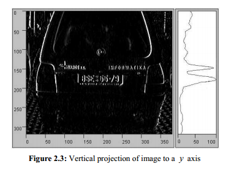  
*__Image:__ изображение после применения HAR.*

__Как работает метод:__  
1. __Извлечение частотных признаков__ → _Текст на табличке создаёт резкие изменения интенсивности (высокочастотные компоненты в пространственной области)._  
2. __Проекция гистограммы__ → _Вычисляется вертикальная проекция (по оси Y) интенсивности пикселей (сумма пиксельных значений по каждой горизонтальной строке)._  

Хотя метод популярен, у него есть недостатки: он зависит от размера автомобиля в кадре, может давать сбои, если машина занимает лишь часть изображения, а на фоне есть посторонние объекты (щиты, рекламные конструкции). Метод также чувствителен к шуму: тени, грязная табличка или неравномерное освещение ухудшают результат.

### Статистический анализ и классификаторы <a id="statistical-analysis-classifiers"></a> [&#129093;](#lpnd)

Как показано выше, предыдущие методы слабо справляются с грязными или повреждёнными табличками, границы плохо выражены, статистические признаки нечетки. Ниже примеры:

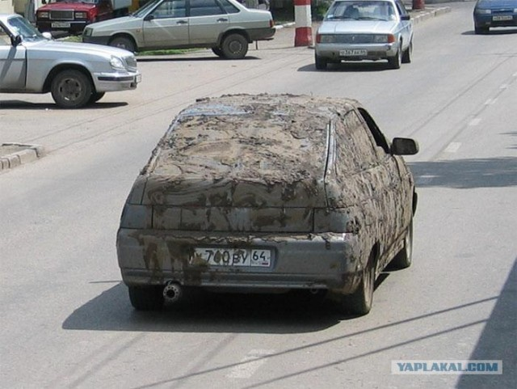  
*__Image:__ пример автомобиля с грязной табличкой.*

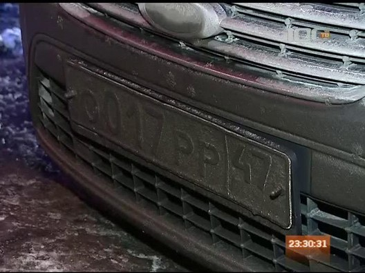  
*__Image:__ ещё один пример грязной таблички.*

Наиболее перспективны методы на основе классификаторов. Например, хорошо показывает себя [каскад Хаара](https://medium.com/analytics-vidhya/haar-cascades-explained-38210e57970d), обученный заранее. Такие методы анализируют область, проверяя наличие характерных признаков табличек: соотношения сторон, точки, градиенты. Ещё один интересный подход — на основе специализированного преобразования. Они позволяют детектировать не только стандартные таблички, но и сложные или нетипичные случаи.

__Слабое место:__  
Многие реальные алгоритмы так или иначе зависят от наличия чётких границ таблички. Даже если границы не используются напрямую, они важны на последующих этапах анализа.  
Удивительно, но для статистических алгоритмов даже относительно чистая табличка на белом автомобиле с хромированной рамкой может стать трудным случаем, так как такие ситуации встречаются реже в обучающих данных.

---

## Реализация LPND  <a id="implementation-lpnd"></a> [&#129093;](#content)

В этом разделе мы не будем реализовывать все описанные методы, а ограничимся первым — [Object Contour Analysis](#object-contour-analysis).  
> Этот метод мы реализуем на языке Python. Если у вас ещё не установлен Python или вы никогда с ним не работали, рекомендую пройти [руководство по установке и началу работы с Python](https://www.w3schools.com/python/python_getstarted.asp).

Нам понадобится изображение с чётко различимым автомобилем и табличкой. Возьмём вот это:

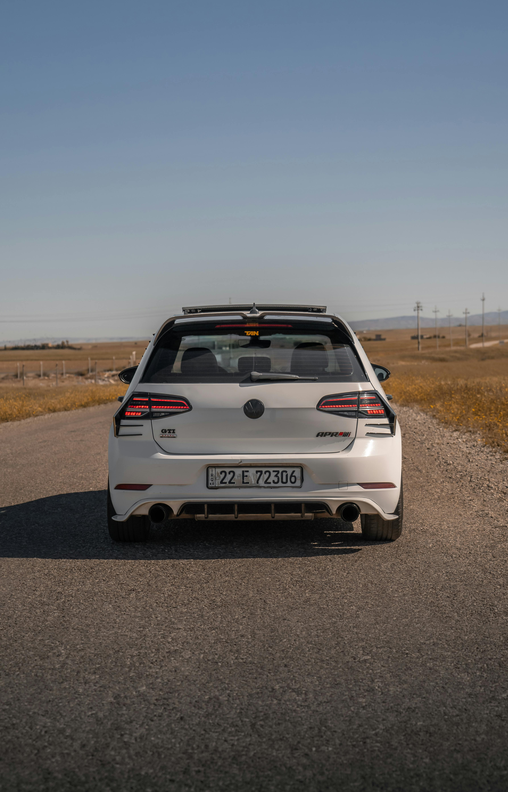  
*__Image:__ фотография высокого качества с автомобилем и номером.*

Его можно скачать [здесь](https://www.pexels.com/ro-ro/fotografie/vedere-din-spate-a-volkswagen-golf-r-alb-pe-drum-deschis-31723208/)

### Настройка среды <a id="setting-up-the-environment"></a> [&#129093;](#implementation-lpnd)

Сначала установим зависимости для реализации __OCA__ в Python. Нам нужны: __opencv-python__, __matplotlib__, __imutils__ и __numpy__.

1. __Создание виртуального окружения__  
   Откройте __cmd__ в папке проекта и выполните:  
   ```cmd
   python -m venv venv
   ```
   Затем активируйте окружение:

   - Для Windows:  
     ```cmd
     venv\Scripts\activate
     ```
   - Для Linux:  
     ```bash
     source venv/bin/activate
     ```

2. __Установка зависимостей__  
   В активированном окружении выполните:
   ```cmd
   pip install opencv-python matplotlib imutils numpy
   ```

### Импорт необходимых библиотек <a id="importing-required-libraries"></a> [&#129093;](#implementation-lpnd)

Создайте файл с расширением `.py`, например `main.py`, и импортируйте библиотеки:
```python
import os
import cv2
import numpy as np
import matplotlib.pyplot as plt
import imutils
```

### Чтение изображения и применение фильтров <a id="reading-image-and-applying-filters"></a> [&#129093;](#implementation-lpnd)

1. __Чтение изображения__  
   С помощью `cv2.imread()`:
   ```python
   image_path = "image.jpg"  # Путь к файлу изображения
   image = cv2.imread(image_path)
   ```

2. __Преобразование из BGR в RGB__  
   OpenCV читает изображение в формате BGR, нам нужен RGB:
   ```python
   image_rgb = cv2.cvtColor(image, cv2.COLOR_BGR2RGB)
   ```

3. __Билатеральный фильтр__  
   Он уменьшает шум, сохраняя резкие границы. Сначала переведём изображение в оттенки серого:
   ```python
   gray = cv2.cvtColor(image, cv2.COLOR_BGR2GRAY)
   ```
   Затем применим фильтр:
   ```python
   bilateral_filter = cv2.bilateralFilter(gray, 11, 17, 17)
   ```

4. __Отображение результата__  
   ```python
   # Конвертируем обратно в RGB для отображения
   bilateral_filter_rgb = cv2.cvtColor(
       bilateral_filter,
       cv2.COLOR_BGR2RGB
   )

   plt.imshow(bilateral_filter_rgb)
   plt.title('Bilateral Filter')
   plt.show()
   ```

### Детектирование границ <a id="edge-detection"></a> [&#129093;](#implementation-lpnd)

Используем алгоритм Canny для определения границ:
1. __Применение Canny__  
   ```python
   image_edged = cv2.Canny(bilateral_filter, 30, 200)
   ```
2. __Отображение__  
   ```python
   image_edged_rgb = cv2.cvtColor(
       image_edged,
       cv2.COLOR_BGR2RGB
   )

   plt.imshow(image_edged_rgb)
   plt.title('Edge Detection')
   plt.show()
   ```

### Поиск контуров <a id="finding-contours"></a> [&#129093;](#implementation-lpnd)

Контуры — это границы областей одинаковой интенсивности.
1. __Нахождение контуров__  
   ```python
   keypoints = cv2.findContours(
       image_edged,
       cv2.RETR_TREE,
       cv2.CHAIN_APPROX_SIMPLE
   )
   ```
2. __Извлечение__  
   ```python
   contours = imutils.grab_contours(keypoints)
   contours = sorted(contours, key=cv2.contourArea, reverse=True)[:10]
   ```
3. __Поиск прямоугольника__  
   ```python
   location = None
   for contour in contours:
       approx = cv2.approxPolyDP(contour, 10, True)
       if len(approx) == 4:
           location = approx
           break
   print(location)
   ```

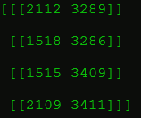

### Отметка номерного знака <a id="marking-number-plate"></a> [&#129093;](#implementation-lpnd)

Создаём маску, оставляя только табличку:
1. __Пустая маска__  
   ```python
   mask = np.zeros(gray.shape, np.uint8)
   ```
2. __Заполнение области таблички__  
   ```python
   image_masked = cv2.drawContours(mask, [location], 0, 255, -1)
   ```
3. __Применение маски__  
   ```python
   image_masked = cv2.bitwise_and(image, image, mask=mask)
   ```
4. __Отображение__  
   ```python
   image_masked_rgb = cv2.cvtColor(
       image_masked,
       cv2.COLOR_BGR2RGB
   )
   plt.imshow(image_masked_rgb)
   plt.title('Masked Image')
   plt.show()
   ```

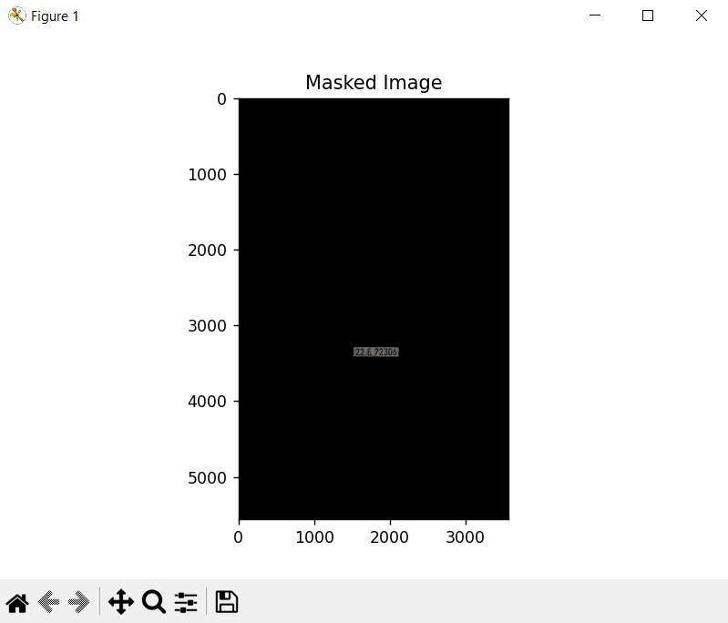

### Выделение номерного знака <a id="extract-number-plate"></a> [&#129093;](#implementation-lpnd)

Вырезаем табличку из изображения:
1. __Получение координат__  
   ```python
   x, y = np.where(mask == 255)
   x1, y1 = (np.min(x), np.min(y))
   x2, y2 = (np.max(x), np.max(y))
   ```
2. __Обрезка__  
   ```python
   image_cropped = gray[x1:x2+1, y1:y2+1]
   ```
3. __Отображение__  
   ```python
   image_cropped_rgb = cv2.cvtColor(
       image_cropped,
       cv2.COLOR_BGR2RGB
   )
   plt.imshow(image_cropped_rgb)
   plt.title('Cropped Image')
   plt.show()
   ```

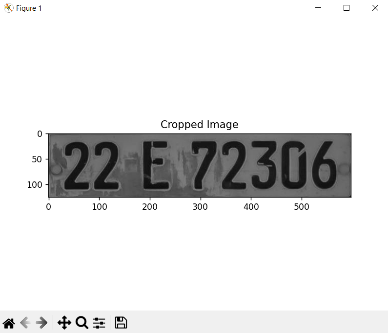

---

## Продвинутые техники LPR  <a id="advanced-lpr"></a> [&#129093;](#content)

Тем, кто хочет глубже изучить __LPND__ и __LPR__, рекомендуется обратить внимание на:

1. Детектирование табличек с использованием предварительно обученных моделей или тренировка собственных с нуля.  
2. Применение методов __Deep Learning__ для более точной детекции.  
3. Углублённое изучение __License Plate Recognition__.  
4. Освоение __OCR__ для автоматического извлечения номера автомобиля с таблички.

---

## Заключение <a id="conclusion"></a> [&#129093;](#content)

В этой статье мы познакомились с общим понятием __License Plate Recognition__, затем подробно рассмотрели четыре метода для реализации __License Plate Number Detection__ и на практике реализовали один из них. Мы выяснили разницу между __LPR__ и __LPND__.  
Для начинающего специалиста, только вступающего на этот путь, материал будет полезен для понимания основных идей, а далее можно углубиться в интересующую тему.

---

## References <a id="references"></a> [&#129093;](#content)

- [Licence Plate Recognition – what it is and how does it work?](https://publicsectornetwork.com/insight/licence-plate-recognition-what-it-is-and-how-it-works)
- [Распознавание номеров: от А до 9](https://habr.com/ru/companies/recognitor/articles/221891/)
- [Выделение границ](https://ru.wikipedia.org/wiki/%D0%92%D1%8B%D0%B4%D0%B5%D0%BB%D0%B5%D0%BD%D0%B8%D0%B5_%D0%B3%D1%80%D0%B0%D0%BD%D0%B8%D1%86)
- [РАСПОЗНАВАНИЕ АВТОМОБИЛЬНЫХ НОМЕРОВ С ПОМОЩЬЮ PYTHON | КОМПЬЮТЕРНОЕ ЗРЕНИЕ | PYTESSERACT, OPENCV](https://www.youtube.com/watch?v=cPl0fnUTSrg&t=195s)
- [Automatic Number Plate Recognition System using EasyOCR](https://www.geeksforgeeks.org/automatic-license-number-plate-recognition-system/)
- [Гистограмма направленных градиентов](http://ru.wikipedia.org/wiki/%D0%93%D0%B8%D1%81%D1%82%D0%BE%D0%B3%D1%80%D0%B0%D0%BC%D0%BC%D0%B0_%D0%BD%D0%B0%D0%BF%D1%80%D0%B0%D0%B2%D0%BB%D0%B5%D0%BD%D0%BD%D1%8B%D1%85_%D0%B3%D1%80%D0%B0%D0%B4%D0%B8%D0%B5%D0%BD%D1%82%D0%BE%D0%B2)
- [Real-Time Edge Detection using OpenCV in Python | Canny edge detection method](https://www.geeksforgeeks.org/real-time-edge-detection-using-opencv-python/)
- [Python OpenCV – Find center of contour](https://www.geeksforgeeks.org/python-opencv-find-center-of-contour/)
- [Обучение OpenCV каскада Хаара](https://habr.com/ru/articles/208092/)